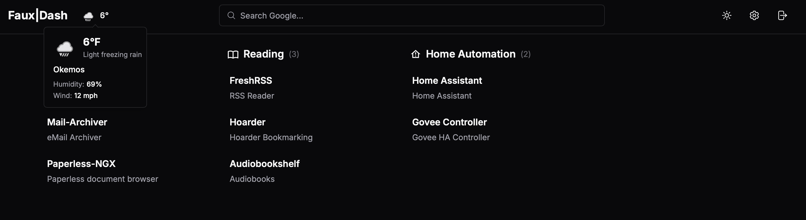
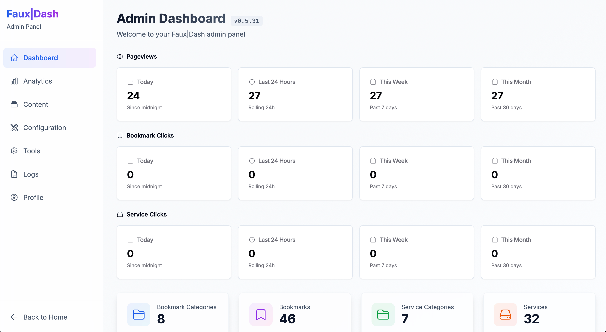

# Faux|Dash

A modern, self-hosted homepage dashboard for managing bookmarks and services. Built as a replacement for [Flame](https://github.com/pawelmalak/flame) with a modern tech stack.

> **Note**: This project was entirely built with AI assistance. Contributions welcome!

---

## ✨ Features

- 📚 **Bookmarks & Services** — Organize links into customizable categories
- 🔍 **Search** — DuckDuckGo, Google, Brave, Kagi, or custom search engines
- 🌤️ **Weather** — Multiple providers with multi-location support
- 📱 **PWA** — Install as a native app on mobile and desktop
- 🔐 **Auth** — Local login + OIDC/SSO (Authentik, Keycloak, Okta)
- 🎨 **Themes** — Light/Dark modes with multiple color accents
- 📊 **Analytics** — Click tracking + GeoIP visitor mapping
- 💾 **Backup** — Full backup/restore with CSV import/export
- 🖱️ **Drag & Drop** — Reorder everything easily

---

## 🚀 Quick Start

```bash
# Pull the image
docker pull ghcr.io/sdenike/fauxdash:latest

# Get the compose file
curl -O https://raw.githubusercontent.com/sdenike/fauxdash/master/docker-compose.sample.yml
mv docker-compose.sample.yml docker-compose.yml

# Generate secret and start
echo "NEXTAUTH_SECRET=$(openssl rand -base64 32)" >> .env
docker compose up -d

# Access at http://localhost:8080
```

Complete the setup wizard to create your admin account.

---

## 📸 Screenshots




---

## ⚙️ Configuration

Most settings are configured in **Admin > Settings**:

| Tab | Features |
|-----|----------|
| **General** | Search engine, welcome messages |
| **Weather** | Provider, locations, display options |
| **Appearance** | Theme, colors, layout, favicon, logo |
| **Email** | SMTP for password reset |
| **Auth** | OIDC/SSO configuration |
| **GeoIP** | Visitor location analytics |

### Environment Variables

Only these are required in your `.env`:

```env
NEXTAUTH_SECRET=<your-secret>  # Required: openssl rand -base64 32
NEXTAUTH_URL=http://localhost:8080
PUID=1000  # Optional: Match your host user
PGID=1000
```

---

## 🔄 Upgrade

```bash
docker compose pull
docker compose up -d
```

Migrations run automatically.

---

## 🛠️ Tech Stack

- **Next.js 16** with React 19
- **SQLite** with Drizzle ORM
- **Tailwind CSS** with shadcn/ui
- **NextAuth.js** for authentication
- **Redis** for caching

---

## 📝 License

MIT License

---

## 🙏 Acknowledgments

- Inspired by [Flame Dashboard](https://github.com/pawelmalak/flame)
- UI from [shadcn/ui](https://ui.shadcn.com/)
- Icons from [Heroicons](https://heroicons.com/), [MDI](https://materialdesignicons.com/), [selfh.st](https://selfh.st/icons/)
- Built with Claude AI
