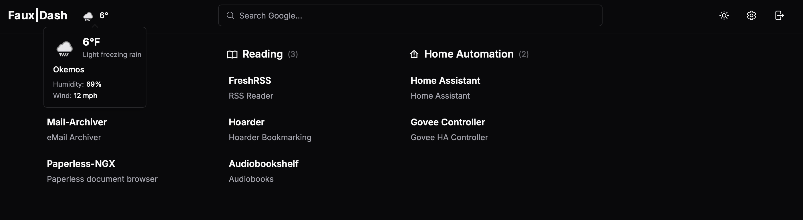
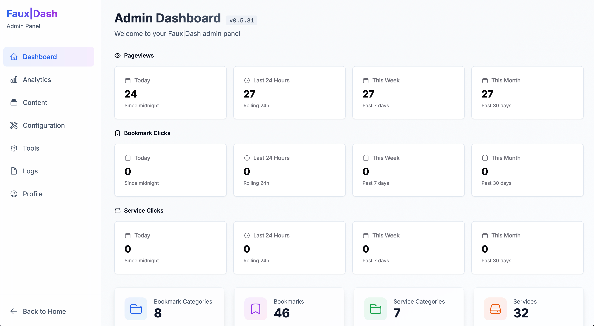

# Faux|Dash

A modern, self-hosted homepage dashboard for managing bookmarks and services. Built as a replacement for [Flame](https://github.com/pawelmalak/flame) with a modern tech stack.

> **Note**: This project was entirely built with AI assistance. While I built this for myself and a few friends I am open for feature requests.

---

## Features

- **Bookmarks & Services** — Organize links into customizable categories with drag & drop reordering
- **Search** — DuckDuckGo, Google, Brave, Kagi, or custom search engines
- **Weather** — Multiple providers (WeatherAPI, OpenWeather, Tempest) with multi-location support
- **PWA** — Install as a native app on mobile and desktop
- **Auth** — Local login + OIDC/SSO (Authentik, Keycloak, Okta, etc.)
- **Themes** — Light/Dark modes with multiple color accents
- **Analytics** — Click tracking with GeoIP visitor mapping
- **Backup** — Full backup/restore with CSV import/export
- **Redis Cache** — Optional external Redis for improved performance
- **Media Library** — Upload and manage custom icons and background images

---

## Quick Start

```bash
# Get the compose file
curl -O https://raw.githubusercontent.com/sdenike/fauxdash/master/docker-compose.sample.yml
mv docker-compose.sample.yml docker-compose.yml

# Start
docker compose up -d

# Access at http://localhost:8080
```

Complete the setup wizard to create your admin account. No manual configuration required.

---

## Screenshots




---

## Configuration

All settings are configured in **Admin > Settings** — no config files needed:

| Tab | Features |
|-----|----------|
| **General** | Search engine, welcome messages |
| **Weather** | Provider, API keys, locations, display options |
| **Appearance** | Theme, colors, layout, custom favicon, logo, background |
| **Email** | SMTP for password reset emails |
| **Auth** | OIDC/SSO configuration |
| **GeoIP** | MaxMind or IPInfo for visitor location analytics |
| **Cache** | External Redis connection settings |

### Zero Config Required

Faux|Dash auto-generates a secure `NEXTAUTH_SECRET` on first run and stores it in `/data/.nextauth_secret`. Just start the container and go.

### Environment Variables

Only a few env vars are ever needed. Everything else is in the Admin UI.

| Variable | Default | Description |
|----------|---------|-------------|
| `NEXTAUTH_URL` | `http://localhost:8080` | Your deployment URL — set this when using a reverse proxy |
| `NEXTAUTH_SECRET` | *(auto-generated)* | Auth secret — auto-generated on first run if not set |
| `PUID` | `1000` | Container user ID for volume permissions |
| `PGID` | `1000` | Container group ID for volume permissions |
| `LOG_LEVEL` | `error` | Log verbosity: `debug`, `info`, `warn`, `error` |

---

## Upgrade

```bash
docker compose pull
docker compose up -d
```

Migrations run automatically on container start.

---

## Reverse Proxy

Set `NEXTAUTH_URL` to your external URL. See [Deployment Guide](docs/DEPLOY.md) for reverse proxy configuration.

---

## Tech Stack

- **Next.js 16** with React 19
- **SQLite** with Drizzle ORM
- **Tailwind CSS** with shadcn/ui
- **NextAuth.js** for authentication

---

## License

MIT License

---

## Acknowledgments

- Inspired by [Flame Dashboard](https://github.com/pawelmalak/flame)
- UI from [shadcn/ui](https://ui.shadcn.com/)
- Icons from [Heroicons](https://heroicons.com/), [MDI](https://materialdesignicons.com/), [selfh.st](https://selfh.st/icons/)
- Built with Claude AI
