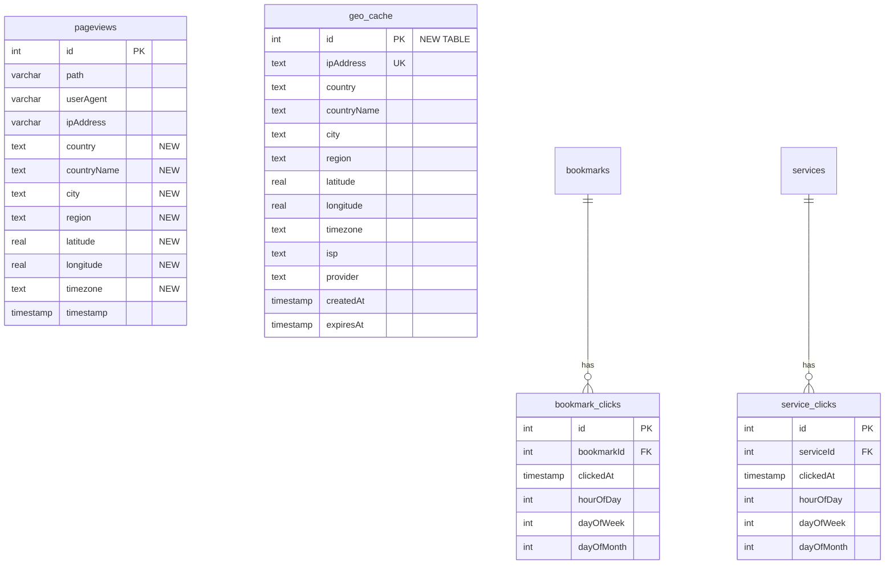

# Analytics Dashboard with GeoIP Visualization

## Enhancement Summary

**Deepened on:** 2026-01-24
**Sections enhanced:** All major sections
**Research agents used:** Recharts optimization, MaxMind implementation, react-simple-maps patterns, Security review, Performance review, Architecture review, Database migration review, TypeScript patterns review, Frontend design review

### Key Improvements
1. **Performance**: Added LTTB downsampling for large datasets, pre-aggregated summary tables, non-blocking GeoIP lookups
2. **Security**: IP address hashing for privacy, encrypted API key storage, Zod validation on all endpoints
3. **Architecture**: Provider chain pattern with tiered caching (LRU memory + database), Result type error handling
4. **Frontend**: Loading skeletons, empty states, Supercluster for map marker clustering, responsive chart design

### New Considerations Discovered
- IP addresses should be hashed (SHA-256) for privacy compliance while still enabling geo aggregation
- GeoIP lookups must be non-blocking - enrich asynchronously after pageview is recorded
- Use pre-aggregated daily/weekly/monthly tables for dashboard queries on large datasets
- Implement LTTB (Largest Triangle Three Buckets) algorithm for chart downsampling
- Use Supercluster for efficient map marker clustering with 1000+ points

---

## Overview

Build a comprehensive analytics dashboard for Faux|Dash that provides detailed insights into bookmark/service usage and visitor geography. The dashboard will display click analytics with time-based breakdowns (day, week, month, year) and visualize visitor locations on an interactive map using server-side IP geolocation.

## Problem Statement / Motivation

Currently, Faux|Dash tracks basic click counts and pageviews but lacks:
- Visual representation of analytics data
- Geographic insights into visitor locations
- Time-series analysis of usage patterns
- Drill-down capabilities for specific time periods

Users want to understand:
- When their bookmarks/services are most used
- Where their visitors come from geographically
- Usage trends over time
- Which items are popular during specific periods

## Existing Infrastructure

**Already in place:**
- `pageviews` table with `ipAddress` field (`src/db/schema.ts:240-270`)
- `bookmark_clicks` table with temporal fields: `hourOfDay`, `dayOfWeek`, `dayOfMonth` (`src/db/schema.ts:379-412`)
- `service_clicks` table with same temporal fields (`src/db/schema.ts:414-447`)
- Stats API at `/api/stats` returning aggregated counts (`src/app/api/stats/route.ts`)
- Settings key-value storage pattern (`src/app/api/settings/route.ts`)
- Click tracking endpoints at `/api/bookmarks/[id]/click` and `/api/services/[id]/click`
- Pageview tracking at `/api/pageview` capturing IP addresses

## Proposed Solution

### High-Level Architecture

```
┌─────────────────────────────────────────────────────────────────┐
│                    Analytics Dashboard                           │
│  /admin/analytics                                                │
├─────────────────────────────────────────────────────────────────┤
│  ┌─────────────┐  ┌─────────────┐  ┌─────────────────────────┐  │
│  │ Time Filter │  │ Date Range  │  │ Item Filter             │  │
│  │ Day/Wk/Mo/Yr│  │ Picker      │  │ Bookmarks/Services/All  │  │
│  └─────────────┘  └─────────────┘  └─────────────────────────┘  │
├─────────────────────────────────────────────────────────────────┤
│  ┌──────────────────────────────────────────────────────────┐   │
│  │                   Clicks Over Time                        │   │
│  │                   (Line/Bar Chart)                        │   │
│  └──────────────────────────────────────────────────────────┘   │
├──────────────────────────┬──────────────────────────────────────┤
│  ┌────────────────────┐  │  ┌────────────────────────────────┐  │
│  │   Top Items        │  │  │      Visitor Map               │  │
│  │   (Table/List)     │  │  │      (Interactive Globe/Map)   │  │
│  └────────────────────┘  │  └────────────────────────────────┘  │
├──────────────────────────┴──────────────────────────────────────┤
│  ┌──────────────────────────────────────────────────────────┐   │
│  │              Hourly/Daily Heatmap                         │   │
│  └──────────────────────────────────────────────────────────┘   │
└─────────────────────────────────────────────────────────────────┘
```

### GeoIP Provider Architecture

```
┌─────────────────────────────────────────────────────────────────┐
│                    GeoIP Service Layer                           │
├─────────────────────────────────────────────────────────────────┤
│  ┌─────────────────┐    ┌─────────────────┐                     │
│  │ MaxMind         │    │ ipinfo.io       │                     │
│  │ GeoLite2        │    │ API             │                     │
│  │ (Default)       │    │ (Alternative)   │                     │
│  └────────┬────────┘    └────────┬────────┘                     │
│           │                      │                               │
│           └──────────┬───────────┘                               │
│                      ▼                                           │
│           ┌─────────────────────┐                               │
│           │  GeoIP Interface    │                               │
│           │  lookup(ip) →       │                               │
│           │  {country, city,    │                               │
│           │   lat, lng}         │                               │
│           └─────────────────────┘                               │
└─────────────────────────────────────────────────────────────────┘
```

## Technical Approach

### Phase 1: Database Schema Extensions

**New columns for `pageviews` table:**

```typescript
// src/db/schema.ts - extend pageviews table
export const pageviews = sqliteTable('pageviews', {
  // ... existing fields
  ipHash: text('ip_hash'),            // SHA-256 hash of IP for privacy
  country: text('country'),           // ISO country code (US, GB, etc.)
  countryName: text('country_name'),  // Full country name
  city: text('city'),
  region: text('region'),             // State/Province
  latitude: real('latitude'),
  longitude: real('longitude'),
  timezone: text('timezone'),
  geoEnriched: integer('geo_enriched', { mode: 'boolean' }).default(false),
});
```

**New `geo_cache` table for IP lookup caching:**

```typescript
// src/db/schema.ts - new table
export const geoCache = sqliteTable('geo_cache', {
  id: integer('id').primaryKey({ autoIncrement: true }),
  ipHash: text('ip_hash').notNull().unique(),  // Store hash, not raw IP
  country: text('country'),
  countryName: text('country_name'),
  city: text('city'),
  region: text('region'),
  latitude: real('latitude'),
  longitude: real('longitude'),
  timezone: text('timezone'),
  provider: text('provider'),         // 'maxmind' or 'ipinfo'
  createdAt: integer('created_at', { mode: 'timestamp' })
    .notNull()
    .default(sql`(unixepoch())`),
  expiresAt: integer('expires_at', { mode: 'timestamp' }), // Cache expiry
});

// Create indexes for analytics queries
// idx_pageviews_timestamp ON pageviews(timestamp)
// idx_pageviews_country ON pageviews(country)
// idx_pageviews_geo_enriched ON pageviews(geoEnriched) WHERE geoEnriched = false
// idx_geo_cache_ip_hash ON geo_cache(ipHash)
// idx_geo_cache_expires ON geo_cache(expiresAt)
```

**New `analytics_daily` pre-aggregated table (for performance with large datasets):**

```typescript
// src/db/schema.ts - pre-aggregated analytics table
export const analyticsDaily = sqliteTable('analytics_daily', {
  id: integer('id').primaryKey({ autoIncrement: true }),
  date: text('date').notNull(),              // YYYY-MM-DD format
  type: text('type').notNull(),              // 'pageview', 'bookmark_click', 'service_click'
  itemId: integer('item_id'),                // NULL for pageviews
  country: text('country'),
  count: integer('count').notNull().default(0),
  uniqueVisitors: integer('unique_visitors').default(0),
});
// Unique index on (date, type, itemId, country)
```

### Research Insights: Database Schema

**Migration Safety:**
- All new columns are nullable to ensure backwards compatibility
- Add columns in a single migration, indexes in a separate migration (reduce lock time)
- Use `geoEnriched` boolean flag to track which pageviews need background enrichment
- Never delete the original `ipAddress` column - keep for backwards compatibility but stop writing new values

**Privacy Considerations:**
- Hash IP addresses using SHA-256 with a server-side salt stored in environment variable
- Original IP retained only temporarily in memory for GeoIP lookup, never persisted
- Implement data retention policy: auto-delete geo_cache entries after configurable period

**Index Strategy:**
- Composite index on `(timestamp, country)` for time-filtered geo queries
- Partial index on `geoEnriched = false` to speed up background enrichment job
- Pre-aggregated `analytics_daily` table reduces query time from O(n) to O(days)

### Phase 2: GeoIP Service Implementation

**File: `src/lib/geoip/index.ts`**

```typescript
// GeoIP provider interface with Result type for error handling
export interface GeoLocation {
  country: string;        // ISO code
  countryName: string;
  city: string | null;
  region: string | null;
  latitude: number | null;
  longitude: number | null;
  timezone: string | null;
}

// Result type for explicit error handling
export type GeoIPResult =
  | { success: true; data: GeoLocation }
  | { success: false; error: GeoIPError };

export type GeoIPError =
  | { code: 'PROVIDER_UNAVAILABLE'; message: string }
  | { code: 'INVALID_IP'; message: string }
  | { code: 'RATE_LIMITED'; retryAfter?: number }
  | { code: 'DATABASE_NOT_FOUND'; path: string }
  | { code: 'LOOKUP_FAILED'; message: string };

export interface GeoIPProvider {
  lookup(ip: string): Promise<GeoIPResult>;
  getName(): string;
  isAvailable(): Promise<boolean>;
}
```

**File: `src/lib/geoip/maxmind.ts`**

```typescript
import maxmind, { CityResponse, Reader } from 'maxmind';
import { GeoIPProvider, GeoIPResult, GeoLocation } from './index';

export class MaxMindProvider implements GeoIPProvider {
  private reader: Reader<CityResponse> | null = null;
  private initPromise: Promise<void> | null = null;

  constructor(private config: {
    databasePath?: string;
    licenseKey?: string;
    accountId?: string;
  }) {}

  getName() { return 'maxmind'; }

  // Lazy initialization - don't load DB until first lookup
  private async ensureInitialized(): Promise<void> {
    if (this.reader) return;
    if (this.initPromise) return this.initPromise;

    this.initPromise = (async () => {
      const dbPath = this.config.databasePath || '/data/GeoLite2-City.mmdb';
      this.reader = await maxmind.open<CityResponse>(dbPath);
    })();

    return this.initPromise;
  }

  async isAvailable(): Promise<boolean> {
    try {
      await this.ensureInitialized();
      return true;
    } catch {
      return false;
    }
  }

  async lookup(ip: string): Promise<GeoIPResult> {
    try {
      await this.ensureInitialized();
      if (!this.reader) {
        return { success: false, error: { code: 'DATABASE_NOT_FOUND', path: this.config.databasePath || '' } };
      }

      const result = this.reader.get(ip);
      if (!result) {
        return { success: false, error: { code: 'LOOKUP_FAILED', message: 'No data for IP' } };
      }

      return {
        success: true,
        data: {
          country: result.country?.iso_code || 'XX',
          countryName: result.country?.names?.en || 'Unknown',
          city: result.city?.names?.en || null,
          region: result.subdivisions?.[0]?.names?.en || null,
          latitude: result.location?.latitude || null,
          longitude: result.location?.longitude || null,
          timezone: result.location?.time_zone || null,
        }
      };
    } catch (error) {
      return { success: false, error: { code: 'LOOKUP_FAILED', message: String(error) } };
    }
  }
}
```

**File: `src/lib/geoip/ipinfo.ts`**

```typescript
import { GeoIPProvider, GeoIPResult } from './index';

export class IpInfoProvider implements GeoIPProvider {
  constructor(private config: { apiKey?: string }) {}

  getName() { return 'ipinfo'; }

  async isAvailable(): Promise<boolean> {
    return true; // API always "available", may be rate limited
  }

  async lookup(ip: string): Promise<GeoIPResult> {
    try {
      const url = this.config.apiKey
        ? `https://ipinfo.io/${ip}?token=${this.config.apiKey}`
        : `https://ipinfo.io/${ip}/json`;

      const response = await fetch(url);

      if (response.status === 429) {
        const retryAfter = parseInt(response.headers.get('Retry-After') || '60');
        return { success: false, error: { code: 'RATE_LIMITED', retryAfter } };
      }

      if (!response.ok) {
        return { success: false, error: { code: 'LOOKUP_FAILED', message: `HTTP ${response.status}` } };
      }

      const data = await response.json();
      const [lat, lng] = (data.loc || ',').split(',').map(Number);

      return {
        success: true,
        data: {
          country: data.country || 'XX',
          countryName: data.country || 'Unknown', // ipinfo doesn't provide full name
          city: data.city || null,
          region: data.region || null,
          latitude: isNaN(lat) ? null : lat,
          longitude: isNaN(lng) ? null : lng,
          timezone: data.timezone || null,
        }
      };
    } catch (error) {
      return { success: false, error: { code: 'LOOKUP_FAILED', message: String(error) } };
    }
  }
}
```

**File: `src/lib/geoip/factory.ts`**

```typescript
import { LRUCache } from 'lru-cache';
import { GeoIPProvider, GeoIPResult, GeoLocation } from './index';
import { MaxMindProvider } from './maxmind';
import { IpInfoProvider } from './ipinfo';

// Tiered caching: LRU memory cache + database cache
const memoryCache = new LRUCache<string, GeoLocation>({
  max: 10000,              // Max 10k entries in memory
  ttl: 1000 * 60 * 60 * 24, // 24 hour TTL
});

// Provider chain: try MaxMind first, fall back to ipinfo
export async function createGeoIPProvider(): Promise<GeoIPProvider> {
  const settings = await getGeoIPSettings();

  const maxmind = new MaxMindProvider({
    databasePath: settings.maxmindDbPath || '/data/GeoLite2-City.mmdb',
    licenseKey: settings.maxmindLicenseKey ? decrypt(settings.maxmindLicenseKey) : undefined,
    accountId: settings.maxmindAccountId,
  });

  const ipinfo = new IpInfoProvider({
    apiKey: settings.ipinfoApiKey ? decrypt(settings.ipinfoApiKey) : undefined,
  });

  // Return chain provider based on settings
  if (settings.provider === 'ipinfo') {
    return new ChainProvider([ipinfo, maxmind]);
  }
  return new ChainProvider([maxmind, ipinfo]);
}

// Chain provider tries each provider in order until one succeeds
class ChainProvider implements GeoIPProvider {
  constructor(private providers: GeoIPProvider[]) {}

  getName() { return 'chain'; }

  async isAvailable(): Promise<boolean> {
    for (const p of this.providers) {
      if (await p.isAvailable()) return true;
    }
    return false;
  }

  async lookup(ip: string): Promise<GeoIPResult> {
    // Check memory cache first
    const cached = memoryCache.get(ip);
    if (cached) {
      return { success: true, data: cached };
    }

    // Try each provider
    for (const provider of this.providers) {
      const result = await provider.lookup(ip);
      if (result.success) {
        memoryCache.set(ip, result.data);
        return result;
      }
    }

    return { success: false, error: { code: 'PROVIDER_UNAVAILABLE', message: 'All providers failed' } };
  }
}
```

### Research Insights: GeoIP Implementation

**Best Practices:**
- Lazy-load MaxMind database on first lookup, not at startup (reduces cold start time)
- Use provider chain pattern - try primary provider, fall back to secondary
- Store API keys encrypted in database, decrypt at runtime
- Implement tiered caching: LRU memory (10k entries) → database (30 days)

**Performance Considerations:**
- MaxMind local DB lookup: ~0.1ms per lookup (very fast)
- ipinfo.io API: ~50-200ms per lookup (use as fallback only)
- Memory cache hit: <0.01ms
- Keep MaxMind DB in memory after first load (~50MB for GeoLite2-City)

**Docker Configuration:**
```dockerfile
# Add to Dockerfile for MaxMind database
ENV MAXMIND_DB_PATH=/data/GeoLite2-City.mmdb
VOLUME ["/data"]

# Or use geoipupdate for automatic updates
RUN apt-get install -y geoipupdate
COPY GeoIP.conf /etc/GeoIP.conf
RUN geoipupdate
```

**Edge Cases:**
- Private/reserved IPs (10.x.x.x, 192.168.x.x, 127.x.x.x): Return null, don't error
- IPv6 support: MaxMind supports it, ensure IP parsing handles both formats
- Cloudflare/proxy headers: Check `CF-Connecting-IP`, `X-Forwarded-For` in order

### Phase 3: Settings Integration

**New settings keys:**

| Key | Type | Default | Description |
|-----|------|---------|-------------|
| `geoipEnabled` | boolean | `true` | Enable/disable GeoIP lookups |
| `geoipProvider` | string | `'maxmind'` | Provider: 'maxmind' or 'ipinfo' |
| `geoipMaxmindDbPath` | string | `'/data/GeoLite2-City.mmdb'` | Path to MaxMind database |
| `geoipMaxmindLicenseKey` | string | `''` | MaxMind license key (for auto-updates) |
| `geoipMaxmindAccountId` | string | `''` | MaxMind account ID (for paid databases) |
| `geoipIpinfoApiKey` | string | `''` | ipinfo.io API key |
| `geoipCacheDays` | number | `30` | Days to cache IP lookups |

**Settings UI location:** New "Analytics" tab in `/admin/settings`

### Phase 4: Analytics API Endpoints

**File: `src/app/api/analytics/clicks/route.ts`**

```typescript
import { z } from 'zod';

// Input validation with Zod
const ClicksQuerySchema = z.object({
  period: z.enum(['day', 'week', 'month', 'year']).default('week'),
  startDate: z.string().datetime().optional(),
  endDate: z.string().datetime().optional(),
  type: z.enum(['bookmarks', 'services', 'all']).default('all'),
  groupBy: z.enum(['hour', 'day', 'week', 'month']).default('day'),
  downsample: z.coerce.number().min(50).max(500).default(150), // Max data points
});

// GET /api/analytics/clicks
// Returns: { labels: string[], datasets: { label: string, data: number[] }[] }

export async function GET(request: NextRequest) {
  // Validate input
  const params = Object.fromEntries(request.nextUrl.searchParams);
  const parsed = ClicksQuerySchema.safeParse(params);
  if (!parsed.success) {
    return NextResponse.json({ error: parsed.error.flatten() }, { status: 400 });
  }

  const { period, startDate, endDate, type, groupBy, downsample } = parsed.data;

  // Query pre-aggregated table for performance
  const data = await db.select()
    .from(analyticsDaily)
    .where(/* date range and type filters */)
    .orderBy(analyticsDaily.date);

  // Apply LTTB downsampling if > maxPoints
  const downsampled = data.length > downsample
    ? lttbDownsample(data, downsample)
    : data;

  return NextResponse.json(formatChartData(downsampled));
}
```

**File: `src/app/api/analytics/geo/route.ts`**

```typescript
import { z } from 'zod';

const GeoQuerySchema = z.object({
  period: z.enum(['day', 'week', 'month', 'year', 'all']).default('month'),
  startDate: z.string().datetime().optional(),
  endDate: z.string().datetime().optional(),
  level: z.enum(['country', 'city']).default('country'),
  limit: z.coerce.number().min(1).max(1000).default(100),
});

// GET /api/analytics/geo
// Returns: {
//   locations: { code: string, name: string, count: number, lat: number, lng: number }[],
//   total: number
// }

export async function GET(request: NextRequest) {
  const params = Object.fromEntries(request.nextUrl.searchParams);
  const parsed = GeoQuerySchema.safeParse(params);
  if (!parsed.success) {
    return NextResponse.json({ error: parsed.error.flatten() }, { status: 400 });
  }

  // Aggregate by country/city with counts
  // Use pre-aggregated table when possible

  return NextResponse.json({ locations, total });
}
```

**File: `src/app/api/analytics/top-items/route.ts`**

```typescript
import { z } from 'zod';

const TopItemsQuerySchema = z.object({
  type: z.enum(['bookmarks', 'services']),
  period: z.enum(['day', 'week', 'month', 'year']).default('week'),
  limit: z.coerce.number().min(1).max(100).default(10),
});

// GET /api/analytics/top-items
// Returns: { items: { id: number, name: string, clicks: number, trend: number }[] }
```

**File: `src/app/api/analytics/heatmap/route.ts`**

```typescript
import { z } from 'zod';

const HeatmapQuerySchema = z.object({
  period: z.enum(['week', 'month', 'year']).default('month'),
  type: z.enum(['bookmarks', 'services', 'pageviews', 'all']).default('all'),
});

// GET /api/analytics/heatmap
// Returns: { data: { hour: number, dayOfWeek: number, value: number }[] }
// Grid: 7 days x 24 hours = 168 cells
```

### Research Insights: API Design

**Security Best Practices:**
- Validate ALL inputs with Zod schemas before processing
- Apply rate limiting: 100 requests/minute per admin user
- Ensure all endpoints check admin authentication
- Never expose raw IP addresses in API responses
- Limit date range queries to prevent DoS (max 1 year)

**Performance Optimizations:**
- Use pre-aggregated `analytics_daily` table for most queries
- Apply LTTB downsampling server-side to limit response size
- Add `Cache-Control` headers for short-term caching (5 minutes)
- Paginate large result sets with cursor-based pagination

**LTTB Downsampling Algorithm:**
```typescript
// Largest Triangle Three Buckets - preserves visual shape while reducing points
function lttbDownsample<T extends { x: number; y: number }>(
  data: T[],
  threshold: number
): T[] {
  if (data.length <= threshold) return data;

  const sampled: T[] = [data[0]]; // Always keep first point
  const bucketSize = (data.length - 2) / (threshold - 2);

  let a = 0;
  for (let i = 0; i < threshold - 2; i++) {
    const bucketStart = Math.floor((i + 1) * bucketSize) + 1;
    const bucketEnd = Math.floor((i + 2) * bucketSize) + 1;
    const bucketEndClamped = Math.min(bucketEnd, data.length - 1);

    // Calculate average point in next bucket
    let avgX = 0, avgY = 0;
    for (let j = bucketStart; j < bucketEndClamped; j++) {
      avgX += data[j].x;
      avgY += data[j].y;
    }
    avgX /= (bucketEndClamped - bucketStart);
    avgY /= (bucketEndClamped - bucketStart);

    // Find point in current bucket with largest triangle area
    let maxArea = -1;
    let maxIndex = bucketStart;
    for (let j = bucketStart; j < bucketEndClamped; j++) {
      const area = Math.abs(
        (data[a].x - avgX) * (data[j].y - data[a].y) -
        (data[a].x - data[j].x) * (avgY - data[a].y)
      );
      if (area > maxArea) {
        maxArea = area;
        maxIndex = j;
      }
    }

    sampled.push(data[maxIndex]);
    a = maxIndex;
  }

  sampled.push(data[data.length - 1]); // Always keep last point
  return sampled;
}
```

### Phase 5: Frontend Components

**Dependencies to add:**

```json
{
  "recharts": "^2.12.0",
  "react-simple-maps": "^3.0.0",
  "supercluster": "^8.0.0",
  "date-fns": "^3.3.0",
  "lru-cache": "^10.0.0"
}
```

**File: `src/app/admin/analytics/page.tsx`**

Main analytics dashboard page with:
- Time period selector (Day/Week/Month/Year/Custom)
- Date range picker
- Filter by type (Bookmarks/Services/All)
- Loading skeletons during data fetch
- Empty state when no data available

**File: `src/components/admin/analytics/clicks-chart.tsx`**

```typescript
'use client';

import { useMemo, memo } from 'react';
import {
  ResponsiveContainer,
  LineChart,
  Line,
  BarChart,
  Bar,
  XAxis,
  YAxis,
  CartesianGrid,
  Tooltip,
  Legend,
} from 'recharts';
import { Card, CardHeader, CardTitle, CardContent } from '@/components/ui/card';
import { Skeleton } from '@/components/ui/skeleton';

interface ClicksChartProps {
  data: { date: string; clicks: number; bookmarks?: number; services?: number }[];
  chartType: 'line' | 'bar';
  isLoading?: boolean;
}

// Memoize to prevent unnecessary re-renders
export const ClicksChart = memo(function ClicksChart({
  data,
  chartType,
  isLoading
}: ClicksChartProps) {
  // Memoize processed data
  const chartData = useMemo(() => {
    return data.map(d => ({
      ...d,
      // Format date for display
      label: new Date(d.date).toLocaleDateString('en-US', { month: 'short', day: 'numeric' }),
    }));
  }, [data]);

  if (isLoading) {
    return (
      <Card>
        <CardHeader>
          <Skeleton className="h-6 w-32" />
        </CardHeader>
        <CardContent>
          <Skeleton className="h-[300px] w-full" />
        </CardContent>
      </Card>
    );
  }

  if (!data.length) {
    return (
      <Card>
        <CardHeader>
          <CardTitle>Clicks Over Time</CardTitle>
        </CardHeader>
        <CardContent>
          <div className="h-[300px] flex items-center justify-center text-muted-foreground">
            No click data available for this period
          </div>
        </CardContent>
      </Card>
    );
  }

  const Chart = chartType === 'line' ? LineChart : BarChart;
  const DataComponent = chartType === 'line' ? Line : Bar;

  return (
    <Card>
      <CardHeader>
        <CardTitle>Clicks Over Time</CardTitle>
      </CardHeader>
      <CardContent>
        <ResponsiveContainer width="100%" height={300}>
          <Chart data={chartData} margin={{ top: 5, right: 30, left: 20, bottom: 5 }}>
            <CartesianGrid strokeDasharray="3 3" className="stroke-muted" />
            <XAxis
              dataKey="label"
              tick={{ fontSize: 12 }}
              tickLine={false}
              axisLine={false}
            />
            <YAxis
              tick={{ fontSize: 12 }}
              tickLine={false}
              axisLine={false}
              tickFormatter={(value) => value.toLocaleString()}
            />
            <Tooltip
              contentStyle={{
                backgroundColor: 'hsl(var(--popover))',
                border: '1px solid hsl(var(--border))',
                borderRadius: '6px',
              }}
            />
            <Legend />
            <DataComponent
              type="monotone"
              dataKey="clicks"
              stroke="hsl(var(--primary))"
              fill="hsl(var(--primary))"
              strokeWidth={2}
              dot={false}
              activeDot={{ r: 4 }}
            />
          </Chart>
        </ResponsiveContainer>
      </CardContent>
    </Card>
  );
});
```

**File: `src/components/admin/analytics/visitor-map.tsx`**

```typescript
'use client';

import { useMemo, useState, memo } from 'react';
import {
  ComposableMap,
  Geographies,
  Geography,
  Marker,
  ZoomableGroup,
} from 'react-simple-maps';
import Supercluster from 'supercluster';
import { Card, CardHeader, CardTitle, CardContent } from '@/components/ui/card';
import { Skeleton } from '@/components/ui/skeleton';

// World map topojson
const geoUrl = 'https://cdn.jsdelivr.net/npm/world-atlas@2/countries-110m.json';

interface Location {
  name: string;
  country: string;
  count: number;
  lat: number;
  lng: number;
}

interface VisitorMapProps {
  locations: Location[];
  isLoading?: boolean;
  onCountryClick?: (countryCode: string) => void;
}

export const VisitorMap = memo(function VisitorMap({
  locations,
  isLoading,
  onCountryClick
}: VisitorMapProps) {
  const [zoom, setZoom] = useState(1);
  const [center, setCenter] = useState<[number, number]>([0, 20]);

  // Use Supercluster for efficient marker clustering
  const clusters = useMemo(() => {
    if (!locations.length) return [];

    const index = new Supercluster({
      radius: 40,
      maxZoom: 16,
      map: (props) => ({ count: props.count }),
      reduce: (acc, props) => { acc.count += props.count; },
    });

    const points = locations.map(loc => ({
      type: 'Feature' as const,
      geometry: { type: 'Point' as const, coordinates: [loc.lng, loc.lat] },
      properties: { name: loc.name, country: loc.country, count: loc.count },
    }));

    index.load(points);
    return index.getClusters([-180, -85, 180, 85], Math.floor(zoom));
  }, [locations, zoom]);

  if (isLoading) {
    return (
      <Card>
        <CardHeader>
          <Skeleton className="h-6 w-32" />
        </CardHeader>
        <CardContent>
          <Skeleton className="h-[400px] w-full rounded-lg" />
        </CardContent>
      </Card>
    );
  }

  if (!locations.length) {
    return (
      <Card>
        <CardHeader>
          <CardTitle>Visitor Locations</CardTitle>
        </CardHeader>
        <CardContent>
          <div className="h-[400px] flex items-center justify-center text-muted-foreground">
            No geographic data available yet
          </div>
        </CardContent>
      </Card>
    );
  }

  return (
    <Card>
      <CardHeader>
        <CardTitle>Visitor Locations</CardTitle>
      </CardHeader>
      <CardContent>
        <ComposableMap
          projectionConfig={{ scale: 147 }}
          className="h-[400px] w-full"
        >
          <ZoomableGroup
            zoom={zoom}
            center={center}
            onMoveEnd={({ zoom, coordinates }) => {
              setZoom(zoom);
              setCenter(coordinates);
            }}
          >
            <Geographies geography={geoUrl}>
              {({ geographies }) =>
                geographies.map((geo) => (
                  <Geography
                    key={geo.rsmKey}
                    geography={geo}
                    fill="hsl(var(--muted))"
                    stroke="hsl(var(--border))"
                    strokeWidth={0.5}
                    style={{
                      default: { outline: 'none' },
                      hover: { fill: 'hsl(var(--accent))', outline: 'none' },
                      pressed: { outline: 'none' },
                    }}
                    onClick={() => onCountryClick?.(geo.properties.ISO_A2)}
                  />
                ))
              }
            </Geographies>
            {clusters.map((cluster, i) => {
              const [lng, lat] = cluster.geometry.coordinates;
              const isCluster = cluster.properties.cluster;
              const count = isCluster
                ? cluster.properties.point_count
                : cluster.properties.count;

              // Scale marker size by count (log scale)
              const size = Math.max(8, Math.min(30, 8 + Math.log10(count) * 8));

              return (
                <Marker key={i} coordinates={[lng, lat]}>
                  <circle
                    r={size}
                    fill="hsl(var(--primary))"
                    fillOpacity={0.7}
                    stroke="hsl(var(--primary-foreground))"
                    strokeWidth={1}
                  />
                  {count > 1 && (
                    <text
                      textAnchor="middle"
                      y={4}
                      fontSize={10}
                      fill="hsl(var(--primary-foreground))"
                    >
                      {count > 999 ? `${(count / 1000).toFixed(1)}k` : count}
                    </text>
                  )}
                </Marker>
              );
            })}
          </ZoomableGroup>
        </ComposableMap>
      </CardContent>
    </Card>
  );
});
```

**File: `src/components/admin/analytics/top-items-table.tsx`**

```typescript
// Table showing top clicked bookmarks/services
// - Loading skeleton with 5 placeholder rows
// - Empty state: "No clicks recorded this period"
// - Columns: Rank, Name, Clicks, Trend (% change with color indicator)
// - Sortable columns
// - Click row to see item details
```

**File: `src/components/admin/analytics/activity-heatmap.tsx`**

```typescript
// Heatmap grid showing activity by hour and day of week
// - 7 rows (days) x 24 columns (hours)
// - Color intensity based on click count (use CSS custom properties)
// - Tooltip on hover showing exact count and time
// - Loading skeleton: 7x24 grid of placeholder cells
// - Empty state: Show grid with "No data" overlay
```

**File: `src/components/admin/analytics/stats-cards.tsx`**

```typescript
// Summary cards at top of dashboard
// - Total Pageviews, Total Clicks, Unique Visitors, Top Country
// - Each card shows: value, % change from previous period, trend arrow
// - Loading: 4 skeleton cards
// - Animate number changes with react-spring or framer-motion
```

### Research Insights: Frontend Components

**Recharts Best Practices:**
- Wrap in `ResponsiveContainer` for automatic sizing
- Use `memo()` to prevent re-renders when parent updates
- Memoize `chartData` transformations with `useMemo`
- Disable `dot` on line charts for performance with many points
- Use CSS custom properties for theme-aware colors

**Map Performance:**
- Use Supercluster for marker clustering (handles 100k+ points)
- Implement zoom-based detail levels (countries → cities → individual points)
- Load topojson asynchronously, show skeleton during load
- Debounce zoom/pan events to reduce re-clustering

**Loading States:**
- Every component needs loading skeleton matching its layout
- Use `Skeleton` component from shadcn/ui
- Skeleton should pulse but not shift layout when data loads

**Empty States:**
- Clear message explaining why no data exists
- Suggest action if applicable ("Start tracking clicks by...")
- Maintain component dimensions to prevent layout shift

**Accessibility:**
- Charts need `aria-label` describing the data trend
- Include data table alternative for screen readers
- Map markers need keyboard navigation support
- Use sufficient color contrast for data visualization

### Phase 6: Enhanced Pageview Tracking

**Update: `src/app/api/pageview/route.ts`**

```typescript
import { createHash } from 'crypto';

// Hash IP for privacy - store hash, not raw IP
function hashIP(ip: string): string {
  const salt = process.env.IP_HASH_SALT || 'default-salt-change-me';
  return createHash('sha256').update(ip + salt).digest('hex').slice(0, 32);
}

// Get client IP from various headers (proxy-aware)
function getClientIP(request: NextRequest): string {
  return (
    request.headers.get('cf-connecting-ip') ||     // Cloudflare
    request.headers.get('x-real-ip') ||            // nginx
    request.headers.get('x-forwarded-for')?.split(',')[0].trim() ||
    request.ip ||
    '0.0.0.0'
  );
}

export async function POST(request: NextRequest) {
  const body = await request.json();
  const ipAddress = getClientIP(request);
  const ipHash = hashIP(ipAddress);

  // CRITICAL: Insert pageview FIRST (non-blocking), enrich geo data LATER
  // This ensures fast response times even if GeoIP is slow
  const pageviewId = await db.insert(pageviews).values({
    path: body.path,
    userAgent: request.headers.get('user-agent') || '',
    ipHash,
    geoEnriched: false, // Will be enriched by background job
  }).returning({ id: pageviews.id });

  // Queue geo enrichment (non-blocking)
  // Option 1: Use Edge Runtime waitUntil
  // Option 2: Trigger background job/queue
  // Option 3: Inline async (fire-and-forget)
  enrichGeoData(pageviewId[0].id, ipAddress, ipHash).catch(console.error);

  return NextResponse.json({ success: true });
}

// Background geo enrichment - runs after response is sent
async function enrichGeoData(pageviewId: number, ipAddress: string, ipHash: string) {
  // Check database cache first
  const cached = await db.select()
    .from(geoCache)
    .where(eq(geoCache.ipHash, ipHash))
    .limit(1);

  let geoData: GeoLocation | null = null;

  if (cached.length && cached[0].expiresAt > new Date()) {
    // Use cached data
    geoData = cached[0];
  } else {
    // Lookup from provider
    const provider = await createGeoIPProvider();
    const result = await provider.lookup(ipAddress);

    if (result.success) {
      geoData = result.data;

      // Update cache
      await db.insert(geoCache)
        .values({
          ipHash,
          ...geoData,
          provider: provider.getName(),
          expiresAt: new Date(Date.now() + 30 * 24 * 60 * 60 * 1000), // 30 days
        })
        .onConflictDoUpdate({
          target: geoCache.ipHash,
          set: { ...geoData, expiresAt: new Date(Date.now() + 30 * 24 * 60 * 60 * 1000) },
        });
    }
  }

  // Update pageview with geo data
  if (geoData) {
    await db.update(pageviews)
      .set({
        country: geoData.country,
        countryName: geoData.countryName,
        city: geoData.city,
        region: geoData.region,
        latitude: geoData.latitude,
        longitude: geoData.longitude,
        timezone: geoData.timezone,
        geoEnriched: true,
      })
      .where(eq(pageviews.id, pageviewId));
  } else {
    // Mark as enriched even if no data (to skip in future)
    await db.update(pageviews)
      .set({ geoEnriched: true })
      .where(eq(pageviews.id, pageviewId));
  }
}
```

### Research Insights: Pageview Tracking

**Non-Blocking Architecture:**
- Never block the pageview response waiting for GeoIP lookup
- Record pageview immediately, enrich asynchronously
- Use `geoEnriched` boolean to track enrichment status
- Background job can catch up on any missed enrichments

**IP Privacy:**
- Hash IPs with SHA-256 + server-side salt before storing
- Never log or persist raw IP addresses
- Salt stored in environment variable, not in code
- Hash truncated to 32 chars (sufficient for uniqueness, reduces storage)

**Proxy/CDN Support:**
- Check headers in order: `CF-Connecting-IP` → `X-Real-IP` → `X-Forwarded-For`
- Take first IP from `X-Forwarded-For` (client IP, not intermediary proxies)
- Fall back to `request.ip` if no proxy headers

**Background Enrichment Options:**
1. **Vercel Edge**: Use `waitUntil()` for fire-and-forget async work
2. **Cron Job**: Run every minute to enrich un-enriched pageviews
3. **Queue**: Push to Redis queue, process with worker
4. **Inline**: Simple `async` call with `.catch()` (works for low traffic)

**Backfill Strategy:**
- For existing pageviews with `ipAddress` but no geo data:
- Create migration script to hash existing IPs
- Run batch enrichment job (rate-limited to avoid API limits)
- Process ~100 IPs per minute for ipinfo.io free tier

## Acceptance Criteria

### Functional Requirements

- [ ] Analytics dashboard accessible at `/admin/analytics` (admin only)
- [ ] Time period filtering: Day, Week, Month, Year, Custom date range
- [ ] Clicks chart displays accurately for selected period
- [ ] Top items table shows most clicked bookmarks/services
- [ ] Activity heatmap shows usage patterns by hour/day
- [ ] Visitor map displays geographic distribution
- [ ] Map supports drill-down from country to city level
- [ ] GeoIP provider configurable in settings (MaxMind/ipinfo)
- [ ] MaxMind advanced settings for paid account support
- [ ] IP lookup results cached to reduce API calls
- [ ] All existing click/pageview data preserved during migration

### Non-Functional Requirements

- [ ] Page loads in under 2 seconds with 100k pageviews
- [ ] GeoIP lookups cached for 30 days (configurable)
- [ ] Charts responsive on mobile devices
- [ ] Map renders smoothly with 1000+ data points
- [ ] No external API calls on page load (use cached data)

### Quality Gates

- [ ] TypeScript strict mode passes
- [ ] Build succeeds without errors
- [ ] Database migrations reversible
- [ ] Admin authentication enforced on all endpoints

## Dependencies & Prerequisites

**NPM Packages:**
- `recharts@^2.12.0` - Charting library (line, bar, area charts)
- `react-simple-maps@^3.0.0` - Map visualization (SVG-based)
- `supercluster@^8.0.0` - Marker clustering for maps
- `maxmind@^4.3.0` - MaxMind database reader
- `lru-cache@^10.0.0` - In-memory caching for GeoIP lookups
- `zod@^3.22.0` - API input validation (may already be present)
- `date-fns@^3.3.0` - Date manipulation (may already be available)

**External Resources:**
- MaxMind GeoLite2 database (free download, requires account registration)
- OR ipinfo.io API key (free tier: 50k requests/month)
- World map topojson: `https://cdn.jsdelivr.net/npm/world-atlas@2/countries-110m.json`

**Environment Variables:**
```env
# Required for IP hashing (generate with: openssl rand -hex 32)
IP_HASH_SALT=your-random-salt-here

# Optional: Pre-configure GeoIP (can also be set via admin UI)
MAXMIND_DB_PATH=/data/GeoLite2-City.mmdb
MAXMIND_LICENSE_KEY=encrypted-license-key
IPINFO_API_KEY=encrypted-api-key
```

**Database:**
- Migration to add geo columns to pageviews (nullable for backwards compatibility)
- Migration to add `ip_hash` column and index
- Migration to create `geo_cache` table with indexes
- Migration to create `analytics_daily` pre-aggregated table
- Backfill script for existing pageviews

## File Structure

```
src/
├── app/
│   ├── admin/
│   │   ├── analytics/
│   │   │   └── page.tsx                    # Main analytics dashboard
│   │   └── settings/
│   │       └── page.tsx                    # Update with GeoIP settings tab
│   └── api/
│       ├── analytics/
│       │   ├── clicks/route.ts             # Click analytics API
│       │   ├── geo/route.ts                # Geographic data API
│       │   ├── top-items/route.ts          # Top items API
│       │   └── heatmap/route.ts            # Heatmap data API
│       └── pageview/
│           └── route.ts                    # Update with geo enrichment
├── components/
│   └── admin/
│       ├── analytics/
│       │   ├── clicks-chart.tsx            # Time series chart (memoized)
│       │   ├── visitor-map.tsx             # Geographic map (Supercluster)
│       │   ├── top-items-table.tsx         # Top items list
│       │   ├── activity-heatmap.tsx        # Hour/day heatmap
│       │   ├── stats-cards.tsx             # Summary cards
│       │   ├── time-filter.tsx             # Period selector
│       │   └── date-range-picker.tsx       # Date range picker
│       └── settings/
│           └── geoip-settings.tsx          # GeoIP provider configuration
├── lib/
│   ├── geoip/
│   │   ├── index.ts                        # Types, Result type, interfaces
│   │   ├── factory.ts                      # Provider factory with chain pattern
│   │   ├── maxmind.ts                      # MaxMind implementation (lazy load)
│   │   ├── ipinfo.ts                       # ipinfo.io implementation
│   │   └── hash.ts                         # IP hashing utilities
│   ├── analytics/
│   │   ├── aggregation.ts                  # Pre-aggregation job
│   │   └── downsampling.ts                 # LTTB algorithm
│   └── validation/
│       └── analytics.ts                    # Zod schemas for analytics APIs
└── db/
    ├── schema.ts                           # Updated with new columns/tables
    └── migrations/
        ├── 0001_add_pageview_geo_columns.ts
        ├── 0002_create_geo_cache_table.ts
        ├── 0003_create_analytics_daily_table.ts
        └── 0004_add_pageview_indexes.ts
```

## Risk Analysis & Mitigation

| Risk | Impact | Mitigation |
|------|--------|------------|
| MaxMind database not available | Map won't show data | Fall back to ipinfo.io, then show "Unknown" location with warning in settings |
| IP lookup rate limiting | Incomplete geo data | Tiered caching (memory + DB), provider chain fallback, batch backfill with rate limiting |
| Large dataset performance | Slow dashboard | Pre-aggregated `analytics_daily` table, LTTB downsampling, date range limits (max 1 year) |
| Privacy concerns with IP tracking | User complaints/GDPR issues | Hash all IPs with SHA-256 + salt, configurable retention policy, ability to disable GeoIP entirely |
| API key exposure | Security breach | Encrypt API keys at rest, never log/expose in errors, use environment variables |
| Chart rendering performance | UI jank | Memoize chart components, downsample data points, lazy-load chart libraries |
| Map with too many markers | Browser memory issues | Supercluster clustering, limit to top 1000 locations, zoom-based detail levels |
| Timezone handling | Incorrect hourly aggregation | Store all timestamps in UTC, convert to user timezone only for display |

### Security Checklist

- [ ] All API endpoints validate input with Zod schemas
- [ ] Admin authentication enforced on all analytics routes
- [ ] API keys encrypted before database storage
- [ ] IP addresses hashed, never stored raw
- [ ] Rate limiting applied (100 req/min per user)
- [ ] Date range queries capped at 1 year maximum
- [ ] No sensitive data in error messages or logs

## Future Considerations

- Export analytics data to CSV/PDF
- Email reports on schedule
- Webhook notifications for traffic spikes
- Comparison mode (this week vs last week)
- Custom dashboard layouts
- Real-time visitor counter (WebSocket)
- Integration with external analytics (Plausible, Umami)
- A/B testing for bookmark layouts
- Custom event tracking beyond clicks
- Funnel analysis for multi-step workflows

## References

### Internal References
- Database schema: `src/db/schema.ts`
- Existing stats API: `src/app/api/stats/route.ts:1-116`
- Pageview tracking: `src/app/api/pageview/route.ts:1-32`
- Click tracking: `src/app/api/bookmarks/[id]/click/route.ts:1-38`
- Settings pattern: `src/app/api/settings/route.ts:1-220`
- Admin settings UI: `src/app/admin/settings/page.tsx`

### External References
- MaxMind GeoLite2: https://dev.maxmind.com/geoip/geolite2-free-geolocation-data
- MaxMind Node.js SDK: https://github.com/maxmind/GeoIP2-node
- ipinfo.io API: https://ipinfo.io/developers
- Recharts: https://recharts.org/en-US/
- Recharts Performance Guide: https://recharts.org/en-US/guide/performance
- react-simple-maps: https://www.react-simple-maps.io/
- Supercluster (marker clustering): https://github.com/mapbox/supercluster
- LTTB Algorithm: https://skemman.is/handle/1946/15343
- Zod: https://zod.dev/

---

## Implementation Phases

### Phase 1: Database & Infrastructure (Day 1-2)
1. Add migrations for geo columns, geo_cache table, analytics_daily table
2. Add indexes for analytics queries
3. Implement IP hashing utility
4. Set up environment variables

### Phase 2: GeoIP Service (Day 2-3)
1. Create GeoIP provider interface with Result type
2. Implement MaxMind provider with lazy loading
3. Implement ipinfo.io provider
4. Create provider chain with tiered caching
5. Add GeoIP settings to admin settings page

### Phase 3: Pageview Enhancement (Day 3-4)
1. Update pageview API with non-blocking geo enrichment
2. Create background enrichment function
3. Create backfill script for existing pageviews
4. Test with various proxy configurations

### Phase 4: Analytics APIs (Day 4-5)
1. Create Zod schemas for API validation
2. Implement clicks API with LTTB downsampling
3. Implement geo API with aggregation
4. Implement top-items and heatmap APIs
5. Add rate limiting middleware

### Phase 5: Frontend Components (Day 5-7)
1. Create stats cards with loading states
2. Create clicks chart with Recharts (memoized)
3. Create visitor map with Supercluster clustering
4. Create top items table
5. Create activity heatmap
6. Create time filter and date range picker
7. Assemble main analytics dashboard page

### Phase 6: Testing & Polish (Day 7-8)
1. Test with large datasets (simulate 100k pageviews)
2. Test GeoIP provider fallback
3. Verify loading states and empty states
4. Performance profiling and optimization
5. Accessibility review

---

## ERD: Database Changes


